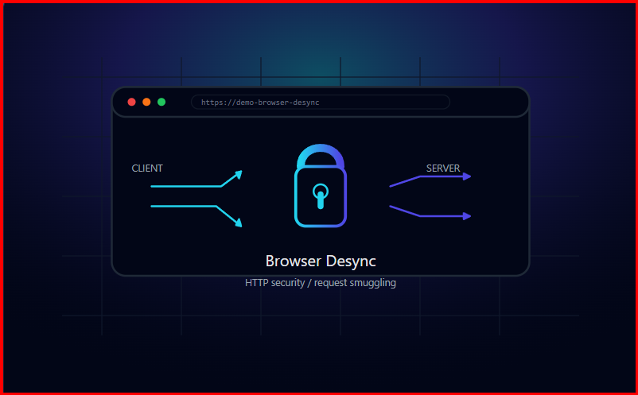
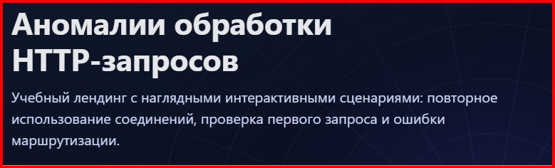
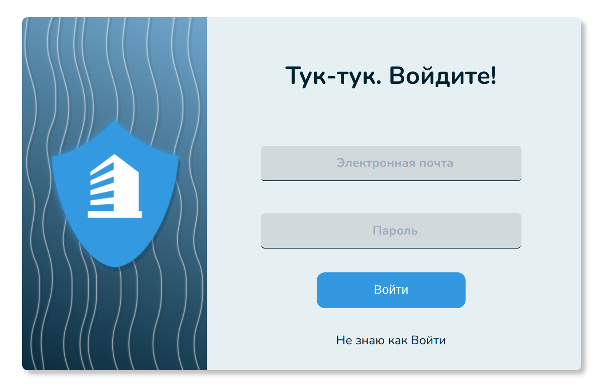

# Лендинги и прочая вёрстка

В этом репозитории собрана небольшая коллекция моих лендингов и учебных демо.

Галерея: 👉 [https://buhtig-sudo-azar.github.io/landings/](https://buhtig-sudo-azar.github.io/landings/)

---

## Лендинги

### Demo: Browser Desync

[Перейти к лендингу](https://buhtig-sudo-azar.github.io/browser-desync-landing/)

Демонстрационный лендинг, объясняющий browser-powered desync-атаки и их влияние на веб-приложения.  
Реализован на чистых HTML, CSS и JS + jQuery.

---

### HTTP Request Handling Anomalies Lab

[Перейти к лендингу](https://buhtig-sudo-azar.github.io/http-request-handling-anomalies/)

Учебный лендинг с интерактивными демо по аномалиям обработки HTTP-запросов, включая First-request routing bypass и другие кейсы.

---

### Дизайн страницы входа

[Перейти к макету](https://buhtig-sudo-azar.github.io/ddg-login-form/)

Небольшой UI-эксперимент с формой авторизации и аккуратной типографикой, сделанный в рамках хакатона.